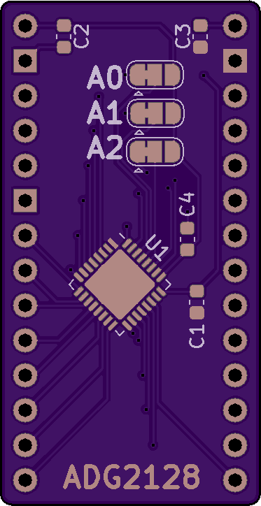
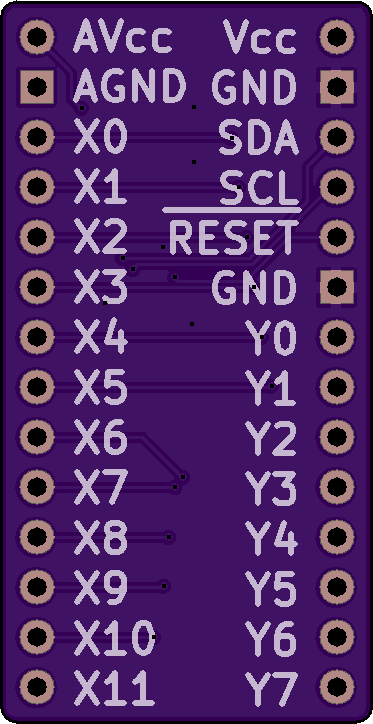

# ADG2128-Breakout

A breakout board for Analog Devices' 8x12 analog cross-point switch

#### [Hackaday.io Page](https://hackaday.io/project/167228-adg2128-breakout)

#### [Order from Tindie](https://www.tindie.com/products/17864/)

------------------------

### What is in this repository:

**./doc**:  Location for documentation

**./KiCAD**:  Hardware design files

**./Arduino**:  Arduino driver

------------------------

### Notes on driver features:

#### Preserve-on-destroy

When the driver instance for the switch is destroyed, the default behavior is to
put the hardware into a known state (reset). This opens all routes. Use-cases
that want the hardware state to outlive the driver's life cycle are possible by
setting preserveOnDestroy(true) ahead of `init()`, like so...

    // Class initializes with the existing state of the hardware.
    adg2128.preserveOnDestroy(true);
    adg2128.init(&Wire);

Since `init()` will also call `reset()` by default, preserveOnDestroy must be
enabled prior to `init()` to achieve the desired result (both sides of the drive life cycle).

#### Throwing many switches at once

The simple use of the driver is to change one switch at a time. But the API allows
an extra parameter to defer action until many switches have been changed, thus allowing
many concurrent changes in hardware at the same time. This is done like so...

    // Both of these calls close their switches immediately. Row 7 spends more
    //   time connected to column 4 than it does to column 5.
    adg2128.setRoute(4, 7);
    adg2128.setRoute(5, 7, false);  // Default value for 3rd parameter is false.

    // In this case, row 8 spends equal time connected to columns 1, 2, and 3.
    adg2128.setRoute(1, 8, true); // Change saved to hardware, but action deferred.
    adg2128.setRoute(2, 8, true); // Change saved to hardware, but action deferred.
    adg2128.setRoute(3, 8);       // This call also closes switches 1:8 and 2:8.

------------------------

Front | Back
:-------:|:------:
  | 

